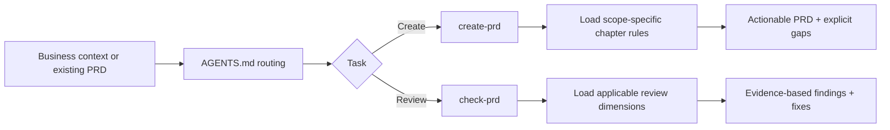

<p align="center">
  
</p>

<h1 align="center">ProductManager</h1>

<p align="center">
  A Codex-native PRD toolkit for Chinese enterprise and B2B product teams.<br/>
  Turn scattered context into implementation-ready specs, then review them against evidence—not appearances.
</p>

<p align="center">
  <a href="LICENSE"></a>
  
  
</p>

<p align="center">
  English ｜ <a href="README_zh-CN.md">简体中文</a>
</p>

<p align="center">
  <a href="https://chenzhiyong1994.github.io/product-manager/"><strong>Project homepage</strong></a> ·
  <a href="https://github.com/chenzhiyong1994/product-manager">GitHub repository</a>
</p>

---

ProductManager is not a universal prompt or an automatic decision maker. It is a maintainable set of project-level Codex Skills that classifies the product and document scope first, loads only the relevant rules, and checks whether a spec can actually support design, engineering, QA, and rollout.

The [GitHub Pages project homepage](https://chenzhiyong1994.github.io/product-manager/) offers a visual overview of both workflows, supported document scopes, review blind spots, and copy-ready quick-start commands.

> The workflows and output templates are Chinese-first. This English README is an overview for international contributors.

## Why this exists

AI-generated PRDs often fail in opposite ways: a tiny change becomes a ceremonial fourteen-chapter document, while a complex system quietly omits states, permissions, data, exceptions, and acceptance criteria.

ProductManager addresses both failure modes:

- **Classify before writing** — commercial vs. internal products, business software vs. tools or transaction platforms, and full systems vs. modules or single changes.
- **Match depth to scope** — full systems receive the complete structure; smaller changes use focused templates.
- **Review against evidence** — every finding must point to a section, page, field, flow, or explicit gap.
- **Cover delivery-critical details** — state transitions, field editability, roles, permissions, exceptions, data models, and acceptance criteria.
- **Load context progressively** — stable routing lives in `SKILL.md`; detailed chapter and review rules live in `references/`.

## Included Skills

| Skill | Use it for | Output |
| --- | --- | --- |
| [`create-prd`](skills/create-prd/SKILL.md) | Writing a PRD or product specification from business context, notes, or a rough idea | Product classification, a scope-aware structure, Mermaid diagrams, state/permission/exception rules, and explicit `[TODO]` gaps |
| [`check-prd`](skills/check-prd/SKILL.md) | Reviewing or improving a PRD, requirements document, SaaS spec, or enterprise system design | Applicable review dimensions, P0–P3 findings, source locations, and prioritized fixes; requested revisions are applied |

Clear requests proceed through the requested scope without classification approval or chapter-by-chapter confirmation. Reviews report evidence-backed findings without a fixed quota; requests to revise also deliver the updated document. Missing business facts remain explicit gaps.

## Workflow



## Quick start

```bash
git clone https://github.com/chenzhiyong1994/product-manager.git
cd product-manager
```

Open the directory in Codex. The root [`AGENTS.md`](AGENTS.md) routes relevant tasks to the project Skills; no global Skill installation is required.

Example request:

> We are adding an equipment-repair module for a retail chain. Store staff submit tickets, managers confirm them, and vendors perform the repair. Classify the requirement first, then write a module-level PRD in Chinese.

Review request:

> Strictly review `docs/repair-module-prd.md`. Focus on ticket states, role-specific actions, timeout exceptions, and acceptance criteria.

See [`examples/README.md`](examples/README.md) for more Chinese-first examples.

## Scope and limitations

- The current release targets Chinese B2B, SaaS, and internal enterprise systems.
- The Skills improve structure and review quality; they do not replace research, stakeholder confirmation, technical review, compliance work, or product judgment.
- Never commit private customer data, interview transcripts, credentials, or internal links to the repository or an Issue.
- Model credentials, external account sessions, and private business examples are intentionally excluded.

## Contributing

Contributions are welcome, especially sanitized failure cases, better rules, and evaluation cases. Please read [`CONTRIBUTING.md`](CONTRIBUTING.md). Report security or privacy issues privately as described in [`SECURITY.md`](SECURITY.md).

## License

[MIT](LICENSE) © ProductManager contributors
