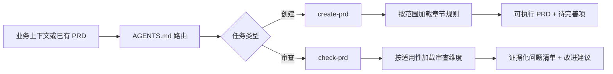

<p align="center">
  
</p>

<h1 align="center">ProductManager</h1>

<p align="center">
  面向中文 B 端与企业产品经理的 Codex 原生 PRD 工具箱<br/>
  把零散上下文整理成可执行方案，也把“看起来完整”的文档审查到真正可落地。
</p>

<p align="center">
  <a href="LICENSE"></a>
  
  
</p>

<p align="center">
  <a href="README.md">English</a> ｜ 简体中文
</p>

---

ProductManager 不是一份万能 Prompt，也不是替产品经理做决定的“自动写文档器”。它是一组可审查、可扩展的项目级 Skill：先识别产品类型与文档范围，再按需加载章节规则，最后用证据化标准检查方案是否足以支撑设计、研发、测试与上线。

## 为什么做这个项目

很多 AI 生成的 PRD 有两个典型问题：小需求被扩写成十几章的“形式完整”，复杂系统却缺少状态、权限、数据和异常等真正影响交付的细节。

ProductManager 将这两类问题拆成明确的工作流：

- **先定型，再生成**：区分商业化产品 / 企业自研系统、业务软件 / 工具 / 交易平台，以及 0-1 系统 / 模块迭代 / 单点变更。
- **复杂度随范围变化**：完整系统使用 14 章结构；模块和单点需求采用更轻的模板，不为完整而完整。
- **证据优先的审查**：每条问题都要指向具体章节、页面、字段或流程，并给出可执行修改方式。
- **覆盖交付盲区**：状态机、字段可编辑性、角色权限、异常路径、数据模型、验收口径和 AI 风险不会被漂亮文案掩盖。
- **渐进加载上下文**：主 Skill 负责路由，章节与审查维度按需加载，便于维护，也减少无关上下文。

## 核心能力

| Skill | 适合什么时候用 | 你会得到什么 |
| --- | --- | --- |
| [`create-prd`](skills/create-prd/SKILL.md) | 从业务背景、会议纪要或简要想法开始写 PRD / 产品方案 | 产品定型、范围匹配的文档结构、流程与 Mermaid 图、权限/状态/异常规则、明确的 `[TODO]` 缺口 |
| [`check-prd`](skills/check-prd/SKILL.md) | 审查或完善已有 PRD、需求文档、SaaS 规格或企业系统方案 | 适用维度、P0–P3 问题、原文定位和优先改法；已要求修订时交付修改后的文档 |

需求清楚时直接完成指定范围，不为产品分类或每一章重复确认。审查按证据报告实际问题，不凑固定数量；只审查时保留原文，要求完善时继续完成修订。缺失的业务事实明确列为待决。

### 覆盖的文档范围

| 文档范围 | 生成策略 | 审查策略 |
| --- | --- | --- |
| 0-1 完整系统 | 完整 14 章 PRD | 14 维严格审查 |
| 系统重构 / 大版本 | 完整结构，强化迁移与兼容 | 严格审查，关注新旧流程和历史数据 |
| 模块级迭代 | 9 节聚焦结构 | 聚焦场景、局部数据、流程、交互和验收 |
| 单点功能变更 | 7 节轻量结构 | 聚焦入口、字段、规则、状态、权限和异常 |
| 快速产品说明 | 最小必要信息 | 判断是否足以支撑沟通与执行 |

## 它是怎样工作的



每个 Skill 的 `SKILL.md` 只维护稳定流程；更细的章节模板、检查标准和重大风险规则放在 `references/` 中，可用的回归用例放在 `evals/` 中。

## 快速开始

### 1. 克隆并打开项目

```bash
git clone https://github.com/chenzhiyong1994/product-manager.git
cd product-manager
```

在 Codex 中打开该目录。根目录的 [`AGENTS.md`](AGENTS.md) 会把相关任务路由到对应的项目 Skill，无需把 Skill 复制到全局目录。

### 2. 直接描述你的任务

创建 PRD：

> 我们要给连锁门店做一个设备报修模块，店员提交、店长确认、维修商处理。先帮我判断需求类型，再写一份模块迭代 PRD。

审查 PRD：

> 请严格审查 `docs/repair-module-prd.md`，重点检查工单状态、不同角色可执行操作、超时异常和验收口径。

Skill 会先完成产品定型或适用性判断。遇到关键信息不足时，它会保留 `[TODO]` 或说明证据缺口，而不是用合理化想象把空白填满。

更多可直接改写的输入示例见 [`examples/README.md`](examples/README.md)。

## 项目结构

```text
product-manager/
├── AGENTS.md                 # 项目边界与任务路由
├── skills/
│   ├── create-prd/           # PRD 创建工作流
│   │   ├── SKILL.md
│   │   └── references/       # 章节模板、定型与自检规则
│   └── check-prd/            # PRD 审查工作流
│       ├── SKILL.md
│       ├── references/       # 14 个审查维度与重大风险规则
│       └── evals/            # 行为与触发评估用例
├── examples/                 # 已脱敏的使用示例
└── assets/readme/            # 项目介绍视觉资产
```

## 设计边界

- 当前版本以中文 B 端、SaaS 和企业系统文档为主要场景，消费产品也可参考，但部分维度需要自行调整。
- Skill 负责提高结构与审查质量，不替代用户研究、业务确认、技术评估、合规审查或最终决策。
- 不要把未经授权的客户资料、访谈原文、账号凭据或企业内部链接提交到仓库或 Issue。
- 仓库只提供工作流规则，不包含模型密钥、外部系统登录态或私有业务样例。

## 路线图

- 增加更多经过脱敏的 PRD 输入与审查示例。
- 为 Skill 规则补充更细粒度的自动化回归验证。
- 扩展用户研究、需求优先级、发布说明等相邻产品工作流。
- 持续降低“看起来专业但无法实施”的输出比例。

## 参与贡献

欢迎提交真实但已脱敏的失败案例、规则改进和新评估用例。开始前请阅读 [`CONTRIBUTING.md`](CONTRIBUTING.md)；发现安全或隐私问题时，请按 [`SECURITY.md`](SECURITY.md) 私下报告。

如果这个框架改善了你的产品工作流，也欢迎在 Issue 中分享它解决了什么问题——真实反馈会直接影响下一步演进。

## License

[MIT](LICENSE) © ProductManager contributors
