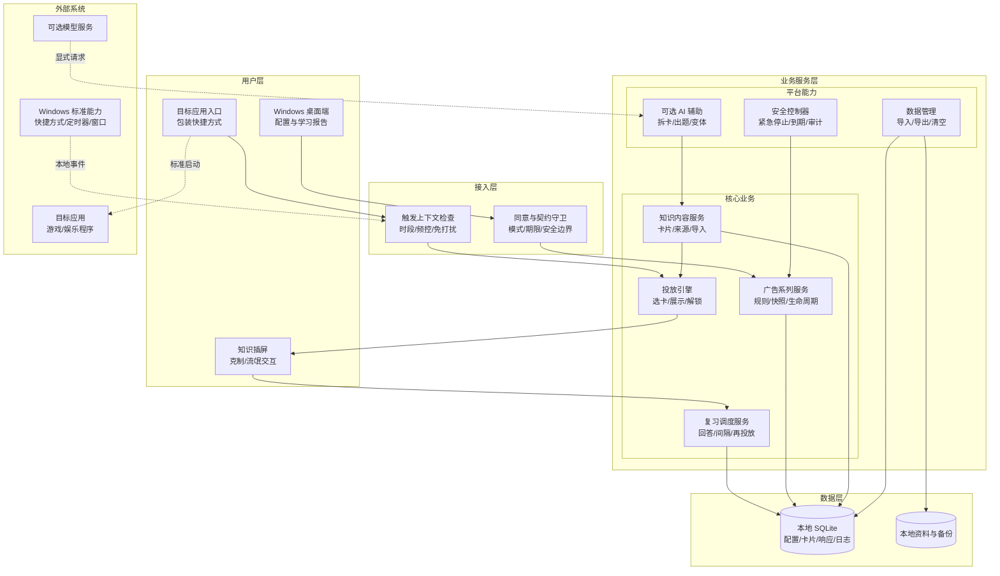
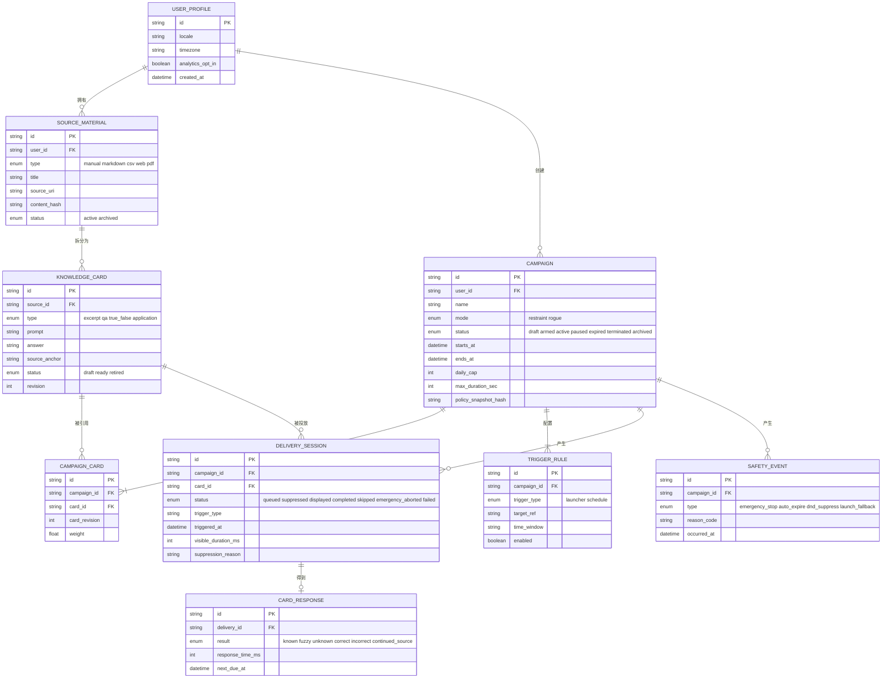
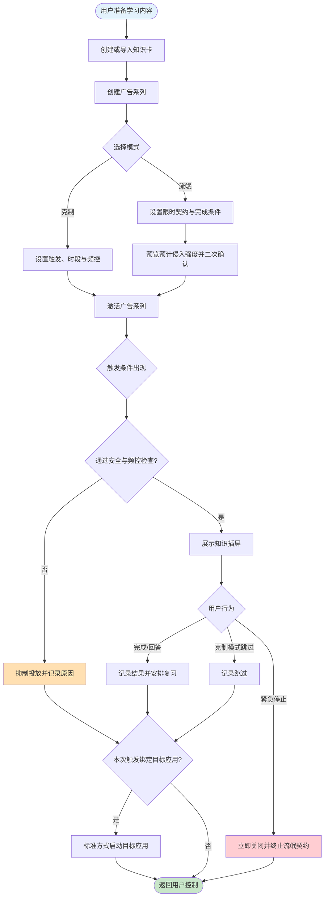
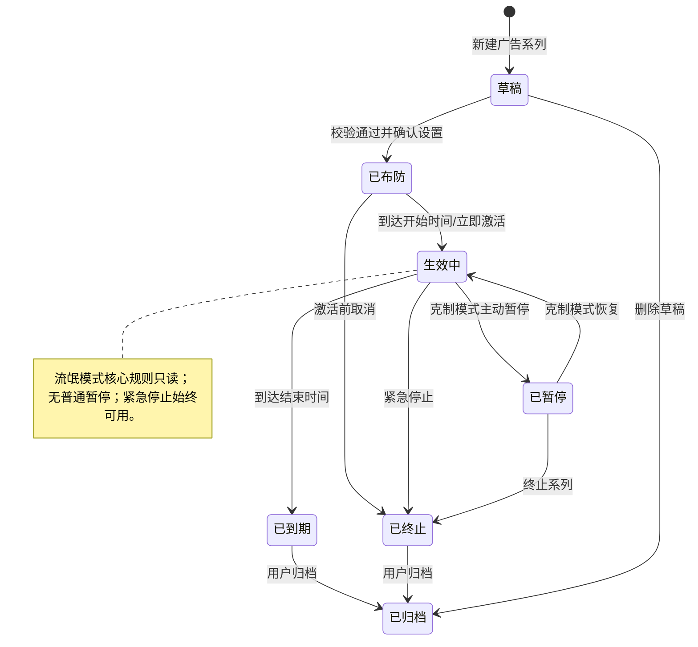
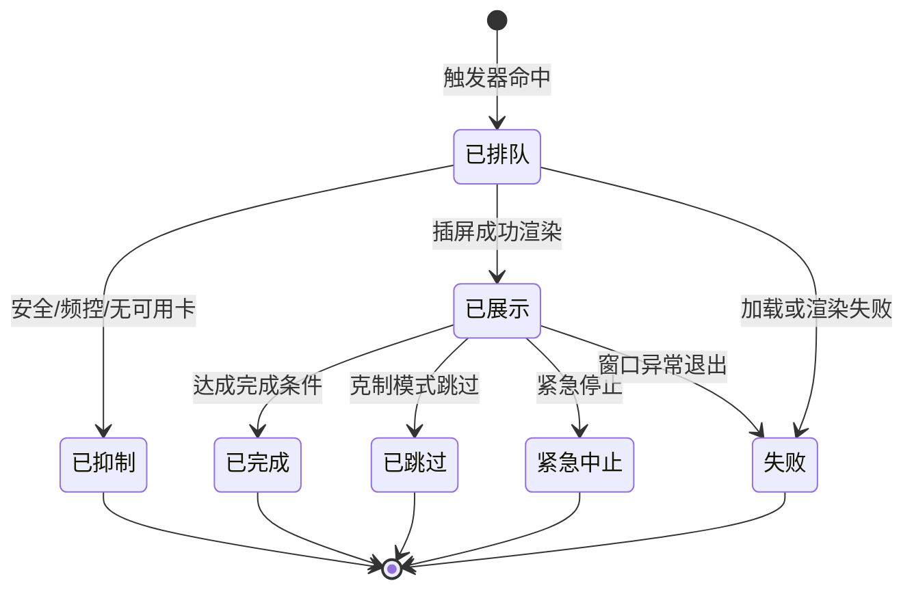

# 知识广告投放工具 PRD（工作名：弹学 PopLearn）

| PRD 审核人 | [TODO: 请指定审核人] |
| --- | --- |
| 重要性 | 高 |
| 紧迫性 | 中 |
| 需求方 | 产品发起人 / 首位种子用户 |
| PRD 编写人 | [TODO: 请填写] |
| PRD 提交日期 | 2026-08-31 |
| 产品定型 | 商业化产品 × 工具型软件 × 0-1 完整系统 |
| 当前阶段 | 概念收敛与 MVP 研发基线 |

## PRD 修改记录

| 变更时间 | 变更内容 | 变更提出部门与理由 | 修改人 | 审核人 | 版本号 |
| --- | --- | --- | --- | --- | --- |
| 2026-08-31 | 建立双模式知识广告产品、MVP、安全边界与研发切片基线 | 产品发起人：用于后续 vibe coding 迭代 | [TODO] | [TODO] | v0.1 |

---

## 1、项目背景

### 1.1 业务现状

目标用户并非不知道应该学习什么。典型现状是：用户已保存网页、PDF、笔记或视频，也有“晚点学习”的明确意图，但娱乐应用提供即时反馈，而打开学习资料意味着重新定位文件、恢复上下文并承受认知负担。结果是资料不断积累，真正消费率很低。

现有工具通常要求用户主动打开：稍后读工具负责收藏，闪卡工具负责复习，屏蔽工具负责限制娱乐，习惯工具负责记录。用户最缺乏行动力的时刻，恰好也是最不愿意主动打开这些工具的时刻。

本项目提出“个人知识广告网络”：由清醒状态下的用户预先选择学习内容、投放场景和干预强度，系统在娱乐入口或用户授权的注意力缝隙主动展示知识卡片。用户既是广告主，也是受众；广告位是自己的屏幕，转化目标是记忆提取或进入原始资料继续学习。

### 1.2 面临问题

1. **学习入口依赖主动性**：用户必须先想起资料、找到资料并打开资料，启动成本高于娱乐应用。
2. **收藏与学习断裂**：保存行为带来“已经处理”的心理满足，但资料缺少再次出现的稳定机制。
3. **碎片曝光容易制造虚假掌握感**：只展示结论会产生熟悉感，不等于用户能够回忆和使用知识。
4. **高强度约束存在反感与安全风险**：真正夺走卸载权、隐蔽驻留或规避安全机制会越过产品和安全边界；过轻则容易被随手跳过。
5. **现有品类各自解决局部问题**：广告拦截、习惯追踪、闪卡、应用限制和 AI 拆解尚未形成“内容供给—场景投放—主动回忆—复习归因”的个人闭环。

### 1.3 解决思路

- 将学习主题建模为“广告系列”，将知识卡建模为“广告素材”，将应用启动、定时窗口等建模为“广告位”。
- 提供两种强度：**克制模式**允许即时跳过和随时修改；**流氓模式**是用户预先同意、限时生效、难以临时反悔但始终可紧急停止和正常卸载的强制契约。
- 使用问题优先、答案后置和间隔重复，衡量延迟回忆而非单纯曝光。
- 采用本地优先架构，MVP 不申请管理员权限，不隐藏进程，不阻止卸载，不规避杀毒软件，不采集无关设备行为。

### 1.4 决策依据

- 用户已明确验证的首要场景是“计划学习但持续打游戏或发呆，甚至不愿打开资料”。
- 广告式投放的关键价值不是视觉样式，而是取消“主动打开学习工具”这一前置动作。
- 产品的首要验证不是内容规模，而是用户能否连续保留这种主动侵入，以及投放能否形成延迟回忆。
- 市场与用户规模、真实资料消费率、愿付价格尚无一手数据，需通过内测建立基线。

> 💡 方法论提示：本章使用“战略机会—执行摩擦—产品闭环”三层分析。当前证据足以支持原型验证，不足以支持市场规模或收入承诺。

## 2、需求基本情况

| 要素 | 内容 |
| --- | --- |
| **需求提出人** | 产品发起人，同时是首位种子用户 |
| **功能使用人** | 已保存学习资料、希望成长但经常被娱乐或惰性截断的个人用户 |
| **受影响人** | 用户本人；被设为触发目标的娱乐应用只受启动顺序影响，不修改其数据 |
| **场景描述** | 见下方三个核心场景 |
| **发生频率** | [假设] 每位目标用户每日存在 3～15 次娱乐启动或注意力切换机会，待内测校准 |
| **核心痛点** | 用户不缺学习意图，缺少无需主动打开、又能承受的学习触发机制 |
| **需求价值** | 将原本被娱乐占据的注意力缝隙转化为可追踪的知识曝光、回忆和深度学习入口 |

### 2.1 核心场景描述

#### 场景 1：打开游戏前的克制投放

- **人物**：希望学习但不愿牺牲娱乐的知识工作者或学生。
- **时间**：晚间工作或学习结束后。
- **地点**：个人 Windows 电脑。
- **起因**：用户点击已纳入规则的游戏启动入口。
- **经过**：系统先展示一张 10～20 秒知识卡；用户可回答、查看答案、继续原资料，也可立即跳过。
- **结果**：游戏正常启动；系统记录展示与反馈，并据此安排后续复习。

#### 场景 2：短期冲刺的流氓契约

- **人物**：临近考试、面试或阶段目标，希望由“清醒时的自己”约束“逃避时的自己”的用户。
- **时间**：用户主动设定的 1～7 天投放周期。
- **地点**：个人 Windows 电脑。
- **起因**：用户创建并二次确认流氓模式契约。
- **经过**：目标娱乐应用启动前出现全屏知识插屏；用户需完成约定的阅读或回忆任务才能继续。核心规则在契约期内锁定，紧急停止始终可用。
- **结果**：完成则解锁目标应用；紧急停止则立即终止本轮强制投放并留下本地安全事件记录。

#### 场景 3：遗忘后的再投放

- **人物**：已看过知识卡但未形成稳定记忆的用户。
- **时间**：首次曝光后的数小时或数天。
- **地点**：用户授权的下一次投放场景。
- **起因**：调度器判断卡片到达复习时间。
- **经过**：系统先提问，再展示答案与来源；根据“知道、模糊、不会”调整下一次投放时间。
- **结果**：形成可追踪的延迟回忆记录，而不是只累计曝光次数。

### 2.2 用户任务（JTBD）

> 当我明知应该学习却想直接进入娱乐时，我希望之前清醒的自己能让一小段知识自动出现在眼前，使我不必先做“打开资料”这个困难动作，同时保留真正退出的最终控制权。

## 3、商业分析

### 3.1 目标市场与客户分析

| 分析维度 | 内容 |
| --- | --- |
| **目标市场** | 个人生产力、碎片学习、数字自控与本地桌面工具的交叉市场 |
| **市场规模** | [TODO: 通过应用商店数据、关键词规模和种子访谈估算 TAM/SAM/SOM；当前不编造金额] |
| **市场特征** | 工具数量多、功能同质化高；用户安装意愿强但长期保留困难；隐私和订阅疲劳影响选择 |
| **发展趋势** | AI 内容原子化、桌面本地优先、注意力管理、神经多样性友好设计和一次性买断重新受到关注 |
| **客户画像** | 18～40 岁学生、知识工作者、独立开发者和终身学习者；拥有个人电脑；已保存大量资料；使用游戏、视频或社交媒体娱乐 |
| **客户痛点** | 不愿主动打开资料；收藏后遗忘；传统屏蔽工具只会“不能玩”，不会告诉用户“现在学什么” |
| **卖点提炼** | 让过去的你向现在的你投放知识广告：不靠想起学习，娱乐入口会主动把知识送到眼前 |

### 3.2 代表产品与替代方案分析

| 分析维度 | 习惯/专注：Forest、Habitica | 屏蔽/自控：Opal、one sec、Forfeit | 学习/拆解：Anki、Goblin Tools | 本产品 |
| --- | --- | --- | --- | --- |
| **商业模式** | 免费增值、订阅、应用内购 | 订阅或增值服务 | 开源、买断、订阅混合 | 开源本地核心 + 可选买断/AI 服务 |
| **主要对象** | 希望培养习惯和专注的人 | 希望减少数字干扰的人 | 已主动进入学习或任务处理的人 | 明知应学习但不愿主动打开资料的人 |
| **核心功能** | 计时、打卡、奖励、连续性 | 延迟、屏蔽、承诺、惩罚 | 闪卡复习、任务拆解、知识管理 | 触发式知识投放、双强度契约、回忆再营销 |
| **核心价值** | 奖励行动和持续性 | 提高娱乐或分心成本 | 提高学习组织和处理效率 | 把学习放进娱乐入口和注意力缝隙 |
| **主要局限** | 仍需主动打开；奖励易疲劳 | 只减少负面行为，不提供正向内容 | 用户必须主动进入工具 | 侵入性可能引发反感；复杂知识不能靠碎片完成 |

> 竞品链接：[Forest](https://www.forestapp.cc/)、[Habitica](https://habitica.com/static/home)、[Opal](https://www.opal.so/)、[one sec](https://one-sec.app/)、[Forfeit](https://www.forfeit.app/)、[Anki](https://apps.ankiweb.net/)、[Goblin Tools](https://www.goblin.tools/)。

### 3.3 差异化定位

1. **不是另一个资料库**：产品的主入口是触发场景，不是内容列表。
2. **不是单纯屏蔽器**：每次增加娱乐摩擦时，都提供一个明确、极小的正向学习动作。
3. **不是流氓软件**：“流氓”是品牌化的预承诺强度，绝不包含隐蔽驻留、卸载阻断、权限滥用或安全规避。
4. **不是微型课程替代品**：碎片卡负责预热、回忆和导流；复杂知识仍回到原始资料深度学习。
5. **本地优先**：内容、回答和触发历史默认只保存在本机，云端与 AI 均为显式可选。

### 3.4 商业模型假设

本产品不是 SaaS-first，优先验证本地工具保留率，再决定服务化程度。

| 层级 | 可能形态 | 收费假设 | 验证条件 |
| --- | --- | --- | --- |
| 开源核心 | 本地卡片、基础投放、克制/流氓模式、Markdown/CSV 导入 | 免费 | 能否形成社区贡献和真实使用反馈 |
| 桌面 Pro | PDF/网页解析、更多触发器、高级统计、主题 | [TODO: 一次性买断价格] | 免费版 28 日留存和高级功能需求 |
| AI 服务 | 来源约束的知识拆解、出题、错题变体 | [TODO: 订阅或按量] | AI 卡片接受率、单位推理成本、隐私接受度 |
| 内容生态 | 可信知识包和创作者分成 | P2，不进入 MVP | 用户规模、内容审核和版权机制成立 |

### 3.5 商业健康指标占位

| 指标 | 初始目标 | 说明 |
| --- | --- | --- |
| 付费转化率 | [TODO] | 在证明用户愿意长期保留后再设定 |
| 月度流失率 | [TODO] | 工具可能采用买断制，需改用活跃留存与升级率 |
| CAC | [TODO] | 初期依靠开源社区和内容传播，不预设付费投放 |
| LTV/CAC | > 3（如采用订阅） | 仅作为未来服务化健康基线 |
| AI 毛利率 | [TODO] | 取决于模型、缓存与本地模型策略 |

## 4、项目收益目标

### 4.1 项目目标

| 目标类型 | 目标描述 | 衡量指标 | MVP 目标值 | 达成时限 |
| --- | --- | --- | --- | --- |
| **问题验证** | 验证用户是否愿意持续保留主动知识投放 | 7 日保留率、绕过率、紧急停止率 | 7 日保留率 ≥ 40%；有效投放绕过率 ≤ 60% | 种子测试第 2 周 |
| **学习效果** | 验证投放能否形成可提取记忆 | 24 小时延迟回忆正确率 | 相对首次回答提升；绝对阈值待基线确定 | 种子测试第 4 周 |
| **操作效率** | 让一次投放无需进入主界面即可完成 | 从触发到卡片可交互耗时 | P95 ≤ 500ms（本地卡片已缓存） | MVP 验收 |
| **安全体验** | 所有用户始终拥有最终控制权 | 紧急停止成功率、正常卸载成功率 | 100%；无管理员权限依赖 | MVP 验收 |
| **商业探索** | 验证高级内容处理的付费意愿 | 访谈愿付率、付费候补名单 | [TODO: 内测后设定] | 公测前 |

上述数值是验证阈值，不是已被市场证明的承诺；内测建立基线后允许通过 PRD 变更记录调整。

### 4.2 产品验收原则

1. 用户可以在 5 分钟内完成首次配置并看到第一张测试卡。
2. 克制模式下用户可即时跳过、暂停和修改规则。
3. 流氓模式只能在二次确认后激活，必须限时、有限频、无自动续约。
4. 流氓模式没有普通跳过，但紧急停止和系统卸载始终有效。
5. 目标应用只在满足约定条件后由产品启动；产品不修改目标应用文件或注入进程。
6. 断网或 AI 不可用不影响本地卡片投放、紧急停止和数据导出。
7. 产品默认不上传知识内容、应用名单、回答记录或触发历史。

### 4.3 成功标准

> MVP 在 10～20 名种子用户中运行 4 周，满足以下条件可进入公测开发：

1. 至少 40% 用户在第 28 天仍主动保留并使用任一模式。
2. 至少 30% 有效投放产生非“立即跳过”的交互。
3. 流氓模式紧急停止率不高于 20%，且无无法退出或误拦截高优先级工作的事故。
4. 延迟回忆数据能证明至少一个主题存在可重复的学习增益信号。
5. 用户明确认为产品减少了“主动打开资料”的成本，而非增加一项维护负担。

## 5、项目方案概述

### 5.1 核心功能概述

| 序号 | 功能模块 | 功能简述 | 优先级 |
| --- | --- | --- | --- |
| 1 | 本地知识库 | 创建、导入、编辑和停用知识卡，保留来源 | P0 |
| 2 | 广告系列 | 将主题、卡片、目标应用、时段和频控组合为可运行计划 | P0 |
| 3 | 克制模式 | 允许即时跳过、暂停和修改规则的轻侵入投放 | P0 |
| 4 | 流氓契约 | 限时、限频、规则锁定且需要完成微任务的强投放 | P0 |
| 5 | 触发与投放 | 通过产品启动入口或本地定时器展示知识插屏 | P0 |
| 6 | 回忆与调度 | 记录“知道/模糊/不会”，安排后续问题式再投放 | P0 |
| 7 | 安全控制 | 免打扰、紧急停止、自动到期、正常卸载和本地审计 | P0 |
| 8 | 学习报告 | 展示有效曝光、延迟回忆和原资料导流 | P1 |
| 9 | 内容辅助 | 来源约束的 AI 拆卡、出题和错题变体 | P1 |
| 10 | 多端与内容生态 | 云同步、移动端、知识包市场 | P2 |

### 5.2 方案概述

- **产品方案**：以“用户自投知识广告”为统一心智，用双强度模式覆盖长期轻干预与短期强制冲刺。
- **技术方案**：MVP 采用 Windows 本地桌面应用、SQLite/本地文件持久化、启动包装器和本地调度器；所有强制行为限定在用户显式配置的入口和时段。
- **运营方案**：先由发起人自用，再邀请少量高意愿知识工作者和学生封闭测试，通过安全事件与保留数据决定是否扩张。

### 5.3 MVP 范围

**MVP 包含：**

- Windows 单用户本地应用。
- 手工创建知识卡，支持 Markdown/CSV 导入。
- 卡片类型：原文片段、问答、判断、应用提示。
- 创建广告系列并选择克制/流氓模式。
- 通过产品生成的目标应用启动入口触发插屏。
- 本地定时触发器；仅在用户选择的时间窗口运行。
- 完成、跳过（仅克制）、知道/模糊/不会、查看来源。
- 简化间隔重复调度。
- 紧急停止、自动到期、免打扰窗口、导出和清空数据。

**MVP 暂不包含：**

- 系统范围进程注入、浏览器内容注入、管理员权限、隐藏驻留或阻止卸载。
- 手机端、云同步、多用户、支付和知识市场。
- 自动抓取所有浏览记录或应用使用记录。
- AI 自动生成后直接投放；P1 即使加入 AI，也必须先由用户确认。
- 金钱惩罚、联系人曝光、公开排行榜和连续打卡。

**核心验证假设：**

1. 用户愿意让学习卡片出现在娱乐入口，并持续保留至少 7～28 天。
2. 克制与流氓模式服务不同使用周期，而不是一方完全替代另一方。
3. 问题优先和再投放能够产生比单次知识曝光更好的延迟回忆。
4. 规则透明、限时和紧急停止能降低强制模式的反感与安全风险。

### 5.4 后续 vibe coding 纵向切片

| 切片 | 独立可用结果 | 主要范围 | 验证证据 |
| --- | --- | --- | --- |
| S0 本地骨架 | 应用可启动、保存一张卡并展示测试插屏 | 本地存储、卡片编辑、测试投放 | 自动化存储测试 + 手工演示 |
| S1 克制闭环 | 从配置目标应用到插屏、跳过/完成并启动应用 | 广告系列、启动包装器、克制交互 | 端到端测试覆盖主路径 |
| S2 流氓契约 | 可创建限时契约、锁定规则、完成门禁或紧急停止 | 状态机、安全控制、审计 | 状态转换测试 + 退出演练 |
| S3 记忆闭环 | 根据回答调度复习并展示学习报告 | 响应记录、复习算法、指标 | 固定时钟的调度单测 |
| S4 内容扩展 | 从网页/PDF生成待确认卡片 | 解析、来源锚点、人工确认 | 样本集准确率与回退测试 |
| S5 公测准备 | 安装、升级、崩溃恢复、可选遥测和发布材料完备 | 安装包、迁移、隐私说明 | 干净环境安装/升级测试 |

> 每个切片必须保持主分支可运行，不以“后续模块会补上”为理由提交断裂流程。

## 6、项目范围

### 6.1 涉及系统

| 系统名称 | 关系类型 | 影响描述 | 责任方 |
| --- | --- | --- | --- |
| 弹学 Windows 客户端 | 主体 | 新建本地桌面工具 | 产品研发团队 |
| 本地文件系统 | 数据来源/存储 | 导入资料、导出备份、保存数据库 | 客户端 |
| Windows 启动入口 | 触发来源 | 由用户显式创建包装快捷方式 | 客户端 |
| 目标娱乐应用 | 被启动方 | 仅延迟启动，不注入、不修改文件 | 第三方应用厂商 |
| 可选 AI 服务 | 内容辅助 | P1 生成待确认卡片，不参与安全控制 | [TODO: 服务商] |
| 可选匿名分析服务 | 数据消费方 | P1 且默认关闭，只接收最小聚合事件 | [TODO: 是否启用] |

### 6.2 影响范围

- **用户影响**：目标用户需要在清醒状态完成内容、触发器和强度配置；流氓模式会在授权期内提高娱乐启动成本。
- **流程影响**：娱乐应用启动从“直接打开”变为“通过弹学入口—满足条件—启动目标应用”。
- **数据影响**：MVP 全部数据本地保存；卸载前提示导出，卸载是否保留用户数据遵循显式选择。
- **上下游影响**：不要求目标应用提供接口；P1 的 PDF/网页解析和 AI 服务为可插拔能力。

### 6.3 不在本期范围内

1. 隐藏进程、静默自启动、阻止任务管理器、阻止卸载、自动恢复被删除文件或规避安全软件。
2. 未经同意监控所有键盘输入、屏幕内容、浏览历史或应用活动。
3. 修改第三方应用、游戏文件，或向其进程注入代码。
4. 面向企业员工的强制培训和管理员远程控制。
5. 面向未成年人的家长控制；如未来进入该场景需单独进行监护、合规与滥用审查。
6. 将碎片学习宣传为对系统课程、深度阅读或专业教育的替代。

## 7、项目风险

### 7.1 前提假设

| 编号 | 假设内容 | 如果假设不成立的影响 |
| --- | --- | --- |
| A1 | 用户愿意在清醒时预先配置干预规则 | 产品无法取得合法和体验上的触发权 |
| A2 | 一次 10～90 秒投放足以完成轻量回忆或启动学习 | 产品只增加打扰，无法产生学习价值 |
| A3 | 用户主要从固定桌面入口打开目标应用 | 包装启动器会被轻易绕过，需引入更可靠但仍合规的触发方式 |
| A4 | 本地优先能建立信任并降低获客阻力 | 若用户更看重跨端同步，MVP 留存可能受限 |

### 7.2 约束条件

| 编号 | 约束描述 | 对设计的影响 |
| --- | --- | --- |
| C1 | 不申请管理员权限 | 无法实现系统级不可绕过，接受“增加摩擦而非绝对封锁” |
| C2 | 紧急停止和正常卸载始终有效 | 流氓模式只能锁定产品内普通设置，不能接管系统控制权 |
| C3 | MVP 默认离线 | 内容、调度和安全控制均需本地运行 |
| C4 | 复杂知识不适合纯碎片首次学习 | 卡片必须保留来源和“继续原文”入口 |
| C5 | 强制模式不得自动续约 | 每个流氓契约到期后必须重新确认 |

### 7.3 风险清单

| 编号 | 风险类别 | 风险描述 | 概率 | 影响 | 应对方案 |
| --- | --- | --- | --- | --- | --- |
| R1 | 产品 | 用户快速形成知识广告盲区或机械点击 | 高 | 高 | 问题优先、素材变体、频控；以延迟回忆而非曝光优化 |
| R2 | 产品 | 流氓模式引发逆反、绕过或卸载 | 高 | 高 | 限时契约、投放预览、硬上限、紧急停止；先验证目标应用启动场景 |
| R3 | 学习效果 | 碎片信息形成熟悉感而非可迁移知识 | 中 | 高 | 引入回忆题、应用题和原资料导流；不宣称替代系统学习 |
| R4 | 安全 | 强制窗口误拦截会议、演示或高优先级工作 | 中 | 高 | 仅在显式入口/时段触发；免打扰名单；紧急停止；不做全局覆盖 |
| R5 | 技术 | 包装启动器与目标应用更新、URI 或反作弊机制不兼容 | 中 | 高 | 不注入进程；使用标准启动方式；失败时立即回退原始启动并记录错误 |
| R6 | 信任 | 安全软件将产品误判为恶意或潜在不受欢迎程序 | 中 | 高 | 行为透明、代码签名、开源审计、无隐藏驻留、清晰权限和卸载说明 |
| R7 | 隐私 | 学习内容和应用清单可能暴露敏感兴趣或工作资料 | 中 | 高 | 默认本地；遥测默认关闭；事件不含正文和文件路径；支持一键清空 |
| R8 | AI | 自动拆卡产生幻觉、断章取义或错误答案 | 中 | 高 | 来源锚点、人工确认后才能投放、AI 不可用时回退手工卡片 |
| R9 | 范围 | 演变为全能学习平台或系统级管控软件 | 高 | 中 | 以“投放与回忆闭环”为产品边界，新增能力必须落入现有闭环 |

## 8、术语和缩略语

| 术语/缩略语 | 全称 | 定义说明 |
| --- | --- | --- |
| 广告系列 | Campaign | 一组学习目标、知识卡、触发规则、强度和投放周期的集合 |
| 知识卡 | Knowledge Card | 一次投放中的最小学习单元，可为原文、问答、判断或应用提示 |
| 广告位 | Inventory | 用户授权可出现知识投放的时间或行为入口 |
| 克制模式 | Restraint Mode | 可即时跳过、暂停和修改规则的轻侵入模式 |
| 流氓模式 | Rogue Mode | 用户预授权的限时强制契约；无普通跳过，但始终可紧急停止和卸载 |
| 有效投放 | Valid Delivery | 卡片成功展示且满足最短可见时间，未因安全策略抑制或加载失败 |
| 延迟回忆 | Delayed Recall | 首次学习后经过指定时间再次回答同一知识目标的能力 |
| 再投放 | Retargeting | 根据回答与遗忘时间再次投放相关卡片或变体 |
| 频控 | Frequency Cap | 每日、每小时或单个时间窗口内允许的最大投放次数 |
| 紧急停止 | Emergency Stop | 立即终止当前插屏并停用流氓契约的安全机制 |
| 来源锚点 | Source Anchor | 卡片与原始资料的文件、URL、页码、段落或时间戳关联 |
| MVP | Minimum Viable Product | 能验证核心闭环的最小可行产品，而非功能数量最少的演示 |

## 9、参考文献和引用文档

| 文档名称 | 版本/日期 | 链接/位置 | 说明 |
| --- | --- | --- | --- |
| Implementation Intentions and Goal Achievement | 2006 | [DOI](https://doi.org/10.1016/S0065-2601%2806%2938002-1) | “如果—那么”实施意图研究 |
| The Nature of Procrastination | 2007 | [PubMed](https://pubmed.ncbi.nlm.nih.gov/17201571/) | 拖延预测因素元分析 |
| Procrastination and the Priority of Short-Term Mood Regulation | 2013 | [DOI](https://doi.org/10.1111/spc3.12011) | 拖延与短期情绪修复 |
| MCII Goal Attainment Meta-analysis | 2021 | [PMC](https://pmc.ncbi.nlm.nih.gov/articles/PMC8149892/) | 心理对照与实施意图效果 |
| Loop Habit Tracker | 持续更新 | [GitHub](https://github.com/iSoron/uhabits) | 本地、无广告、非二元连续性参考 |
| ActivityWatch | 持续更新 | [GitHub](https://github.com/ActivityWatch/activitywatch) | 可选的本地行为数据生态参考，MVP 不依赖 |
| 产品隐私政策 | [TODO] | [TODO: 发布前创建] | 说明本地数据、可选遥测和 AI 数据流 |
| 威胁模型与安全设计 | [TODO] | [TODO: S2 前创建] | 记录强制模式、更新、IPC 和本地数据风险 |

## 10、功能需求

### 10.1 产品框架概述

#### 10.1.1 应用架构图

架构约束：安全控制器、紧急停止、契约到期和本地投放不得依赖网络或 AI 服务；目标应用通过标准方式启动，不进行代码注入。

#### 10.1.2 数据模型图

| 实体 | 业务含义 | 关键规则 |
| --- | --- | --- |
| USER_PROFILE | 本机单用户设置 | MVP 仅一条有效记录，不要求登录 |
| SOURCE_MATERIAL | 原始学习材料 | 可归档不可静默删除；正文默认本地 |
| KNOWLEDGE_CARD | 最小投放内容 | Ready 才可投放；必须具备来源或标记为手工原创 |
| CAMPAIGN | 学习广告系列/强制契约 | 流氓模式激活时保存不可变规则快照 |
| TRIGGER_RULE | 投放入口和时间条件 | MVP 仅 launcher 与 schedule |
| DELIVERY_SESSION | 一次投放尝试 | 被抑制也需记录原因，但不计有效曝光 |
| CARD_RESPONSE | 用户回答与复习计划 | 用于计算下一次到期时间 |
| SAFETY_EVENT | 安全相关事件 | 只保存在本地；导出时显式包含 |

#### 10.1.3 核心业务流程图

#### 10.1.4 广告系列状态机

##### 状态转换明细

| 当前状态 | 触发事件 | 目标状态 | 操作角色 | 前置条件 | 后置影响 | 备注 |
| --- | --- | --- | --- | --- | --- | --- |
| 草稿 | 布防 | 已布防 | 用户 | 至少 1 张 Ready 卡、1 条触发规则；流氓模式结束时间 ≤ 7 天 | 生成规则预览；流氓模式生成快照待确认 | 校验失败保持草稿 |
| 已布防 | 激活 | 生效中 | 用户/调度器 | 已二次确认且到达开始时间 | 启用触发器，记录激活时间 | 不自动延长结束时间 |
| 生效中 | 暂停 | 已暂停 | 用户 | 仅克制模式 | 停止普通投放 | 流氓模式不显示普通暂停 |
| 已暂停 | 恢复 | 生效中 | 用户 | 克制模式且未过结束时间 | 重新启用触发器 | — |
| 生效中 | 到期 | 已到期 | 调度器 | 当前时间 ≥ ends_at | 停止投放并生成总结 | 不自动续约 |
| 生效中 | 紧急停止 | 已终止 | 用户 | 无 | 立即关闭插屏、停止触发、写 SAFETY_EVENT | 不要求网络或管理员权限 |
| 草稿/已到期/已终止 | 归档 | 已归档 | 用户 | 无活动投放 | 从默认列表隐藏 | 保留历史记录 |

##### 状态字段可编辑性矩阵

| 核心实体 | 状态 | 字段/操作 | 是否可见 | 是否可编辑/可触发 | 可操作角色 | 触发条件 | 校验规则 | 变更后影响 | 审计要求 |
| --- | --- | --- | --- | --- | --- | --- | --- | --- | --- |
| 广告系列 | 草稿 | 名称、模式、时间、频控、卡片、触发器 | 是 | 是 | 用户 | 无 | 名称必填；至少一张 Ready 卡 | 更新草稿 | 记录 updated_at |
| 广告系列 | 草稿 | 布防 | 是 | 可触发 | 用户 | 校验通过 | 流氓模式必须二次确认 | 状态→已布防 | 记录规则快照 hash |
| 广告系列 | 已布防 | 核心规则 | 是 | 仅克制模式可编辑；流氓模式只读 | 用户 | 尚未开始 | 修改后重新校验和确认 | 更新快照 | 记录前后 hash |
| 广告系列 | 生效中 | 普通暂停 | 克制可见；流氓隐藏 | 克制可触发 | 用户 | 克制模式 | 无 | 状态→已暂停 | 记录 |
| 广告系列 | 生效中 | 核心规则 | 是 | 克制可编辑；流氓只读 | 用户 | 克制模式 | 修改不得突破安全上限 | 立即应用 | 记录前后值 |
| 广告系列 | 生效中 | 紧急停止 | 是 | 可触发 | 用户 | 无 | 二次确认不得阻塞立即执行 | 状态→已终止，停止全部触发 | 必须记录 |
| 广告系列 | 已暂停 | 规则/恢复/终止 | 是 | 可编辑/可触发 | 用户 | 克制模式 | 结束时间已过则只能到期 | 更新或恢复 | 记录 |
| 广告系列 | 已到期/已终止 | 复制、归档 | 是 | 可触发 | 用户 | 无 | 复制产生新草稿，不复用旧同意 | 新建或归档 | 记录 |
| 广告系列 | 已归档 | 查看历史、恢复为草稿副本 | 是 | 历史只读；可复制 | 用户 | 无 | 不允许直接重新激活 | 新建草稿 | 记录 |

#### 10.1.5 投放会话状态机

| 当前状态 | 触发事件 | 目标状态 | 操作角色 | 前置条件 | 后置影响 | 备注 |
| --- | --- | --- | --- | --- | --- | --- |
| 已排队 | 安全检查不通过 | 已抑制 | 系统 | 命中免打扰、频控、到期或无卡 | 记录 suppression_reason；不计有效投放 | 目标应用默认继续启动 |
| 已排队 | 插屏渲染成功 | 已展示 | 系统 | 本地卡片可用 | 记录 displayed_at | P95 目标 ≤ 500ms |
| 已展示 | 完成条件满足 | 已完成 | 用户 | 阅读计时、回答或指定动作完成 | 生成 CARD_RESPONSE，启动目标应用 | — |
| 已展示 | 跳过 | 已跳过 | 用户 | 仅克制模式 | 记录跳过，启动目标应用 | 流氓模式不显示该入口 |
| 已展示 | 紧急停止 | 紧急中止 | 用户 | 无 | 关闭插屏并终止相关契约 | 最高优先级 |
| 任意未终态 | 技术故障 | 失败 | 系统 | 超时、崩溃、数据错误 | 失败开放：不得阻止目标应用或紧急退出 | 写错误日志 |

##### 投放状态字段可编辑性矩阵

| 核心实体 | 状态 | 字段/操作 | 是否可见 | 是否可编辑/可触发 | 可操作角色 | 触发条件 | 校验规则 | 变更后影响 | 审计要求 |
| --- | --- | --- | --- | --- | --- | --- | --- | --- | --- |
| 投放会话 | 已排队 | suppression_reason | 否 | 系统写入 | 系统 | 安全检查失败 | 必须使用枚举原因 | 状态→已抑制 | 记录 |
| 投放会话 | 已展示 | 回答/显示答案 | 是 | 可触发 | 用户 | 卡片已渲染 | 回答只能提交一次，可撤销 5 秒 | 生成响应 | 记录响应类型和耗时，不记录输入正文 |
| 投放会话 | 已展示 | 跳过 | 克制可见 | 克制可触发 | 用户 | 克制模式 | 无 | 状态→已跳过 | 记录 |
| 投放会话 | 已展示 | 紧急停止 | 是 | 可触发 | 用户 | 无 | 必须立即响应 | 状态→紧急中止；契约→已终止 | 必须记录 |
| 投放会话 | 终态 | 所有字段 | 历史页可见 | 只读 | 用户 | 无 | 不可篡改；可删除全部历史 | 无 | 保留至用户清空 |

#### 10.1.6 功能清单

| 子系统 | 页面/界面 | Windows 桌面 | 浏览器扩展 | 移动端 | MVP 说明 |
| --- | --- | --- | --- | --- | --- |
| 入门 | 首次启动与安全说明 | ✓ | — | — | P0 |
| 内容 | 资料与知识卡列表 | ✓ | — | — | P0 |
| 内容 | 知识卡编辑器 | ✓ | — | — | P0 |
| 系列 | 广告系列列表 | ✓ | — | — | P0 |
| 系列 | 系列编辑与投放预览 | ✓ | — | — | P0 |
| 契约 | 流氓模式确认页 | ✓ | — | — | P0 |
| 投放 | 知识插屏 | ✓ | — | — | P0 |
| 复习 | 历史与学习报告 | ✓ | — | — | P1，MVP 可先简化 |
| 安全 | 免打扰与紧急停止 | ✓ | — | — | P0 |
| 数据 | 导入、导出、清空 | ✓ | — | — | P0 |
| AI | 待确认卡片工作台 | ✓ | — | — | P1 |
| 扩展 | 网页广告位替换 | — | P2 | — | 非 MVP |
| 扩展 | 通知与锁屏卡片 | — | — | P2 | 非 MVP |

### 10.2 产品需求详解

#### 10.2.1 首次启动与安全同意

##### 10.2.1.1 业务流程

`首次启动 → 阅读产品边界 → 选择本地数据目录 → 创建测试知识卡 → 预览克制插屏 → 进入首页`

用户必须在启用任何流氓模式前单独完成契约确认；首次启动同意不能替代具体契约同意。

##### 10.2.1.2 页面交互

**首次启动页**

| 页面要素 | 类型 | 默认值 | 必填 | 说明 |
| --- | --- | --- | --- | --- |
| 产品边界摘要 | 静态文本 | 展示 | — | 明确“不阻止卸载、不隐藏、不上传正文” |
| 数据目录 | 路径选择 | 应用默认目录 | 是 | 必须可写；禁止选择系统根目录 |
| 匿名分析 | 开关 | 关闭 | 否 | 不影响核心功能 |
| 创建示例卡 | 开关 | 开启 | 否 | 示例卡可删除 |
| 完成设置 | 按钮 | — | — | 校验通过后进入测试插屏 |

##### 10.2.1.3 业务规则

| 编号 | 规则类型 | 规则描述 |
| --- | --- | --- |
| FR-ONB-001 | 约束 | 未完成本地目录校验前不得进入主界面 |
| FR-ONB-002 | 事实 | 匿名分析默认关闭，且不得与核心功能绑定 |
| FR-ONB-003 | 触发条件 | 首次完成配置后必须展示一次可立即关闭的测试插屏 |
| FR-ONB-004 | 约束 | 流氓模式同意必须逐广告系列获取，禁止用通用条款一次性覆盖 |

本模块不涉及状态字段可编辑性差异；首次启动完成后，可在设置页重新查看安全说明和修改数据目录。

#### 10.2.2 本地知识库与知识卡

##### 10.2.2.1 业务流程

`新增/导入资料 → 创建知识卡 → 编辑问题与答案 → 补充来源锚点 → 标记 Ready → 加入广告系列`

##### 10.2.2.2 页面交互

**知识卡列表**

| 字段名称 | 默认值 | 类型 | 可修改 | 必填 | 备注 |
| --- | --- | --- | --- | --- | --- |
| 标题/问题 | — | 文本 | 是 | 是 | 列表显示前 80 字 |
| 卡片类型 | 问答 | 枚举 | 是 | 是 | 原文、问答、判断、应用提示 |
| 来源 | 手工创建 | 文本/链接 | 是 | 条件必填 | AI 或导入卡必须有来源 |
| 状态 | 草稿 | 枚举 | 是 | 是 | 草稿、Ready、停用 |
| 下次到期 | — | 日期时间 | 系统计算 | 否 | 无回答历史时为空 |
| 所属系列 | — | 标签集合 | 关联修改 | 否 | 可多选 |

**知识卡编辑器操作**

| 按钮 | 操作说明 | 触发条件 | 权限 |
| --- | --- | --- | --- |
| 保存草稿 | 保存当前输入 | 标题/问题非空 | 本机用户 |
| 标记 Ready | 允许进入投放池 | 问题/内容、答案（适用时）、来源校验通过 | 本机用户 |
| 预览 | 使用实际插屏样式查看 | 卡片可渲染 | 本机用户 |
| 停用 | 停止未来投放 | 非活动流氓快照的唯一副本，或由快照保留修订 | 本机用户 |
| 查看原文 | 打开来源锚点 | 来源有效 | 本机用户 |

##### 10.2.2.3 业务规则

| 编号 | 规则类型 | 规则描述 |
| --- | --- | --- |
| FR-CARD-001 | 事实 | 一张卡只承载一个主要知识目标 |
| FR-CARD-002 | 约束 | 单张卡正文建议 ≤ 400 中文字；超过阈值提示拆分但不强制阻断 |
| FR-CARD-003 | 约束 | AI 生成卡片必须处于草稿，用户确认后才可 Ready |
| FR-CARD-004 | 触发条件 | 活动流氓系列引用的卡片修改时，系列继续使用激活时修订快照 |
| FR-CARD-005 | 推论 | 连续两次回答“知道/正确”的卡片延长复习间隔；“不会/错误”缩短间隔 |
| FR-CARD-006 | 计算 | MVP 默认间隔：未知=10 分钟，模糊/错误=1 天，已知/正确=3 天；后续按历史逐级扩展 |

卡片存在状态差异：草稿可编辑但不可投放；Ready 可编辑且可投放；停用只读并停止新投放。历史投放引用具体修订号，避免内容变化污染学习记录。

#### 10.2.3 广告系列与双模式配置

##### 10.2.3.1 业务流程

`新建系列 → 选择卡片 → 选择模式 → 设置触发器/时间/频控 → 预览 → 校验 → 布防/签署契约 → 激活`

##### 10.2.3.2 页面交互

**广告系列编辑页**

| 字段名称 | 默认值 | 类型 | 克制模式 | 流氓模式 | 校验规则 |
| --- | --- | --- | --- | --- | --- |
| 系列名称 | — | 文本 | 必填 | 必填 | 1～50 字 |
| 学习目标 | — | 文本 | 选填 | 必填 | 流氓模式需说明短期目标 |
| 模式 | 克制 | 单选 | 可选 | 可选 | 激活后不可切换 |
| 开始时间 | 立即 | 日期时间 | 可选 | 必填 | 不早于当前时间 |
| 结束时间 | 无/手动关闭 | 日期时间 | 可选 | 必填 | 流氓模式最长 7 天 |
| 每日上限 | 5 | 数字 | 1～20 | 1～15 | 不能超过产品硬上限 |
| 单次最长 | 20 秒 | 数字 | 5～60 秒 | 10～90 秒 | 展示预估负担 |
| 完成条件 | 阅读/回答 | 枚举 | 可选 | 必填 | 流氓模式至少一个可完成条件 |
| 目标应用 | — | 文件/URI | 至少一项触发来源 | 至少一项触发来源 | 必须可由标准方式启动 |
| 免打扰窗口 | 工作日 09:00～18:00 | 时间段 | 可编辑 | 激活前可编辑 | 允许多个窗口 |
| 知识卡 | — | 多选 | 至少 1 张 | 至少 3 张 | 仅 Ready 卡 |

**流氓契约确认页**必须完整显示：目标、开始/结束时间、每日最大次数、单次最大时长、触发目标、完成条件、免打扰、紧急停止方法、不会执行的恶意行为以及不自动续约声明。

##### 10.2.3.3 业务规则

| 编号 | 规则类型 | 规则描述 |
| --- | --- | --- |
| FR-CAM-001 | 约束 | 流氓模式持续时间 MVP 最长 7 天，不允许无限期或自动续约 |
| FR-CAM-002 | 约束 | 流氓模式激活后，模式、结束时间、上限、目标应用和完成条件只读 |
| FR-CAM-003 | 触发条件 | 流氓模式必须完成“摘要确认 + 长按确认”两步，且确认页可返回 |
| FR-CAM-004 | 事实 | 克制模式始终提供“跳过”和“暂停系列” |
| FR-CAM-005 | 事实 | 流氓模式不提供普通跳过或暂停，但始终显示紧急停止入口 |
| FR-CAM-006 | 约束 | 增加强度或延长期限必须创建新契约，不得修改已生效快照 |
| FR-CAM-007 | 推论 | 当连续出现安全抑制时，不补发超过每日上限的投放 |

状态可编辑性以 10.1.4 矩阵为准。

#### 10.2.4 触发器与知识插屏

##### 10.2.4.1 业务流程

**启动包装器触发：**

`用户点击弹学快捷方式 → 校验目标路径 → 命中有效系列 → 安全/频控检查 → 选卡 → 展示插屏 → 完成或跳过 → 标准启动目标应用`

**定时触发：**

`本地调度器到期 → 检查前台安全条件 → 展示或抑制 → 记录结果 → 计算下次时间`

##### 10.2.4.2 页面交互

**知识插屏**

| 元素 | 克制模式 | 流氓模式 | 说明 |
| --- | --- | --- | --- |
| 系列名称 | 可见 | 可见 | 明确投放来源 |
| 问题/原文 | 可见 | 可见 | 首屏只呈现一个目标 |
| 显示答案 | 可用 | 按卡片规则可用 | 问答卡先尝试再显示 |
| 知道/模糊/不会 | 可用 | 可用 | 点击后提交响应 |
| 跳过 | 可见、立即可用 | 不可见 | 克制模式专属 |
| 稍后提醒 | 可选 | 不可见 | 不得造成同一时段无限追投 |
| 查看来源 | 可见 | 完成后可见 | 打开原文可视为完成条件之一 |
| 紧急停止 | 设置中可达 | 始终可见 | 流氓模式点击后立即关闭当前插屏 |
| 剩余时间/条件 | 可选 | 必须可见 | 不使用虚假倒计时 |

##### 10.2.4.3 业务规则

| 编号 | 规则类型 | 规则描述 |
| --- | --- | --- |
| FR-DEL-001 | 触发条件 | 只有广告系列生效、触发规则命中、频控未超限且存在到期卡时才展示 |
| FR-DEL-002 | 约束 | 插屏加载失败、数据损坏或目标应用路径异常时失败开放，不得无限阻塞用户 |
| FR-DEL-003 | 约束 | 流氓模式插屏必须展示真实剩余条件，不得伪装系统警告或关闭按钮 |
| FR-DEL-004 | 计算 | 选卡优先级 = 学习权重 × 到期程度 × 历史错误权重 ÷ 近期曝光惩罚 |
| FR-DEL-005 | 约束 | 同一卡片在 10 分钟内不得重复展示，除非用户主动选择“再来一次” |
| FR-DEL-006 | 触发条件 | 插屏完成或克制模式跳过后，目标应用仅启动一次 |
| FR-DEL-007 | 约束 | 定时插屏遇到用户全屏演示、免打扰或安全排除条件时直接抑制，不抢占输入焦点 |

#### 10.2.5 回忆反馈与学习报告

##### 10.2.5.1 业务流程

`提交反馈 → 生成响应记录 → 计算下一次到期 → 后续问题式投放 → 聚合有效曝光与延迟回忆 → 展示报告`

##### 10.2.5.2 页面交互

**学习报告页**

| 展示项 | 计算口径 | 默认周期 | 说明 |
| --- | --- | --- | --- |
| 有效投放数 | completed + skipped，且达到最短可见时间 | 7 天 | 与展示尝试数分开 |
| 主动回答率 | 有回答的投放 / 有效投放 | 7 天 | 不代表正确率 |
| 延迟回忆正确率 | 延迟 ≥ 24h 的正确回答 / 对应回答数 | 28 天 | 样本过小时显示“数据不足” |
| 跳过率 | skipped / 克制模式有效投放 | 7 天 | 流氓模式不适用 |
| 紧急停止率 | emergency_stop / 流氓契约数 | 28 天 | 用于评估强度是否过高 |
| 原资料导流率 | continued_source / 有效投放 | 28 天 | 衡量是否进入深度学习 |

##### 10.2.5.3 业务规则

| 编号 | 规则类型 | 规则描述 |
| --- | --- | --- |
| FR-REV-001 | 事实 | 曝光、回答正确和掌握是三个不同指标，不得合并宣传 |
| FR-REV-002 | 计算 | 延迟回忆仅统计距离首次或上次学习至少 24 小时的回答 |
| FR-REV-003 | 约束 | 样本数 < 5 时不展示百分比结论，只展示原始次数 |
| FR-REV-004 | 推论 | 紧急停止或跳过率持续升高时，报告建议降低频率，不自动替用户修改 |
| FR-REV-005 | 约束 | 报告不使用连续打卡、羞辱性红色警告或“你失败了”等文案 |

#### 10.2.6 安全控制与紧急停止

##### 10.2.6.1 业务流程

`用户触发紧急停止 → 立即关闭所有插屏 → 终止活动流氓契约 → 禁用其触发器 → 尝试继续原目标应用 → 记录本地安全事件 → 返回安全设置`

##### 10.2.6.2 页面交互

**安全设置页**

| 设置项 | 默认值 | 可编辑时机 | 说明 |
| --- | --- | --- | --- |
| 全局紧急停止快捷键 | [TODO: 避免与系统快捷键冲突] | 始终 | 设置失败不得影响页面入口 |
| 免打扰时间 | 工作时段 | 始终；活动流氓模式只能扩大保护范围 | 安全设置优先于契约强度 |
| 排除应用 | 会议/演示类默认建议 | 始终；只能新增保护 | 不扫描应用内容 |
| 启动失败回退 | 开启 | 始终 | 投放异常时直接启动目标应用 |
| 清空本地数据 | — | 始终 | 二次确认后执行，不与契约锁定绑定 |

##### 10.2.6.3 业务规则

| 编号 | 规则类型 | 规则描述 |
| --- | --- | --- |
| FR-SAFE-001 | 约束 | 紧急停止优先级高于任何投放、回答、倒计时和契约规则 |
| FR-SAFE-002 | 约束 | 紧急停止不能依赖网络、AI、登录或远端许可 |
| FR-SAFE-003 | 触发条件 | 紧急停止后当前流氓系列状态立即变为“已终止”，不可原地恢复 |
| FR-SAFE-004 | 约束 | 活动流氓契约允许随时扩大免打扰和安全排除，但不得借此改变内容或延长期限 |
| FR-SAFE-005 | 约束 | 应用关闭或崩溃后不得通过隐蔽守护进程反复拉起 |
| FR-SAFE-006 | 约束 | 卸载、导出和清空数据不受流氓契约锁定 |

#### 10.2.7 数据导入、导出与清理

##### 10.2.7.1 业务流程

`选择文件 → 预检字段/数量/编码 → 展示导入预览 → 用户确认 → 事务写入 → 输出成功与失败明细`

##### 10.2.7.2 页面交互

| 操作 | 输入 | 输出 | 失败处理 |
| --- | --- | --- | --- |
| Markdown 导入 | 标题、正文、可选问答约定 | 草稿卡片 | 逐项错误，不写入无效项 |
| CSV 导入 | 模板字段 | 草稿或 Ready 卡片 | 下载错误明细 |
| 全量导出 | 本地数据库 | JSON + Markdown/CSV | 原子写入临时文件后替换 |
| 清空历史 | 日期范围/全部 | 删除响应与投放历史 | 二次确认，保留卡片与系列可选 |
| 清空全部 | 确认文字 | 删除全部业务数据 | 不删除应用本身，操作后回到首次启动 |

##### 10.2.7.3 业务规则

| 编号 | 规则类型 | 规则描述 |
| --- | --- | --- |
| FR-DATA-001 | 约束 | 导入必须先预览，禁止部分字段静默截断 |
| FR-DATA-002 | 约束 | 全量导出必须包含版本号和 Schema 版本 |
| FR-DATA-003 | 触发条件 | 数据库迁移前自动创建可恢复备份 |
| FR-DATA-004 | 约束 | 清空数据和卸载入口不得因活动流氓契约禁用；清空全部数据前先按紧急停止语义终止活动契约并关闭插屏 |
| FR-DATA-005 | 约束 | 默认遥测事件不得包含卡片正文、答案、文件路径、目标应用完整路径 |

#### 10.2.8 AI 内容辅助（P1）

##### AI 功能设计

> 💡 采用“低确定性 × 中等容错”判断：AI 可提出待确认内容，不能直接成为权威答案或安全决策者。推荐交互模式为 Copilot/辅助填充，而非后台全自动投放。

| 分析维度 | 评估 |
| --- | --- |
| 确定性 | 中低：拆分粒度、重点选择和题目质量具有主观性 |
| 容错性 | 中：错误卡片会误导学习，但用户确认和来源校验可降低风险 |
| 推荐交互模式 | Copilot + 辅助填充；所有输出进入待确认工作台 |

**AI 交互设计：**

- **AI 执行**：从用户显式选择的材料中提出知识目标、问题、答案草稿和来源锚点。
- **用户确认**：逐张接受、编辑或拒绝；未确认卡片不能进入 Ready。
- **系统保证**：展示来源片段，检测答案是否缺少来源覆盖；不能证明时标记“需人工核实”。
- **降级方案**：模型不可用、配额不足或超时时，保留原始资料并回退手工建卡。
- **隐私边界**：发送前显示将上传的片段和服务商；支持本地模型或用户自备 API Key 的未来实现。
- **监控指标**：生成接受率、人工修改率、来源覆盖率、错误举报率、生成后弃用率和单张卡成本。

| 编号 | 规则类型 | 规则描述 |
| --- | --- | --- |
| FR-AI-001 | 约束 | AI 生成内容默认草稿，不得自动加入活动系列 |
| FR-AI-002 | 约束 | 每张 AI 卡必须保存来源锚点和模型生成元数据 |
| FR-AI-003 | 触发条件 | 用户删除源材料时，相关 AI 卡标记来源失效但不静默删除 |
| FR-AI-004 | 约束 | AI 服务失败不得影响本地投放与紧急停止 |

### 10.3 异常情况处理方案

| 异常类型 | 异常场景 | 处理方案 |
| --- | --- | --- |
| 网络异常 | AI 请求、更新检查或可选遥测断网 | 本地核心继续运行；请求显式失败或排队，不影响投放和退出 |
| 并发冲突 | 主界面修改系列时调度器正准备投放 | 事务 + 版本号；投放读取已提交快照，编辑保存时检测版本冲突 |
| 数据异常 | SQLite 损坏、卡片字段缺失 | 启动只读恢复模式；从最近备份恢复或导出可读数据；禁止进入流氓投放 |
| 误操作 | 错误启用流氓模式 | 激活前二次确认；激活后可紧急停止；不阻止卸载和清空 |
| 业务异常 | 系列生效但没有 Ready 卡 | 抑制投放，提示系列需要内容；目标应用正常启动 |
| 启动异常 | 目标应用路径失效或启动失败 | 提示重新定位；不得反复弹卡；保留一次“仅关闭”入口 |
| 渲染异常 | 插屏白屏、卡死或窗口失焦 | 5 秒看门狗失败开放；关闭插屏、启动目标应用、记录错误 |
| 时间异常 | 用户修改系统时间、跨时区或休眠恢复 | 使用 UTC 存储；本地时区展示；不补发超过上限的历史投放 |
| 频控异常 | 多触发器同时命中 | 全局互斥锁合并为一次投放；目标应用每次用户启动只执行一次 |
| 安全异常 | 紧急停止快捷键注册失败 | 页面紧急停止仍可用；流氓模式不得激活，直至至少一种可靠退出方式通过自检 |
| 更新异常 | 升级中断或 Schema 迁移失败 | 回滚应用版本和数据库备份；不得带着不完整迁移进入投放 |
| AI 异常 | 来源与答案矛盾或用户举报错误 | 卡片立即停用，保留审计信息；不自动改写为另一个答案 |

### 10.4 非功能需求与工程约束

| 类别 | 要求 | 验证方式 |
| --- | --- | --- |
| 性能 | 本地缓存命中时插屏 P95 在触发后 500ms 内可交互 | 性能测试，至少 1,000 张卡 |
| 稳定性 | 客户端崩溃不得持续阻塞目标应用；流氓模式失败开放 | 故障注入与崩溃恢复测试 |
| 安全 | 不申请管理员权限、不注入进程、不隐藏卸载入口 | 安装包权限审计、代码检查 |
| 隐私 | 默认无遥测；本地正文不出设备；可一键导出和清空 | 数据流审查、断网运行测试 |
| 可访问性 | 键盘可操作、焦点清晰、支持屏幕缩放和减少动画 | 手工无鼠标测试、辅助功能检查 |
| 可维护性 | 数据库 Schema 有版本；关键规则有单元测试；触发器使用适配器接口 | CI 检查、迁移测试 |
| 可观测性 | 本地日志分级且默认不含正文和绝对路径 | 日志快照测试 |
| 兼容性 | [TODO: 确认支持 Windows 10/11 范围] | 干净环境安装、升级、卸载测试 |

### 10.5 MVP 验收用例

| 用例编号 | Given | When | Then |
| --- | --- | --- | --- |
| AC-01 | 用户有 1 张 Ready 卡和有效目标应用 | 创建克制系列并点击包装入口 | 插屏出现；跳过后目标应用只启动一次 |
| AC-02 | 用户处于克制插屏 | 点击“知道” | 响应被记录，下一次到期时间生成，目标应用启动 |
| AC-03 | 用户创建 8 天流氓契约 | 点击布防 | 校验阻断并说明 MVP 最长 7 天 |
| AC-04 | 流氓契约已激活 | 用户打开系列编辑页 | 核心规则只读，紧急停止可见 |
| AC-05 | 流氓插屏正在显示 | 用户触发紧急停止 | 插屏立即关闭，系列变为已终止，目标应用按安全策略继续 |
| AC-06 | 插屏渲染模块抛出异常 | 用户启动目标应用 | 看门狗失败开放，目标应用启动且写入失败日志 |
| AC-07 | 已达到每日上限 | 再次触发包装入口 | 不展示插屏，直接启动目标应用并记录“频控抑制” |
| AC-08 | 数据库损坏 | 启动客户端 | 进入恢复模式，不启动流氓触发器，允许恢复/导出 |
| AC-09 | AI 服务断网 | 用户执行本地投放 | 本地投放和紧急停止正常工作 |
| AC-10 | 活动流氓契约存在 | 用户通过系统卸载 | 正常卸载，不被产品阻止 |

## 11、数据埋点

### 11.1 埋点策略

- **目标**：回答“投放是否被接受、是否产生延迟回忆、强度是否造成反感、用户是否进入原资料”。
- **默认策略**：MVP 仅在本地生成指标；远端匿名分析默认关闭。
- **最小化原则**：远端事件不得包含知识正文、答案、源文件名、完整路径、目标应用完整路径或用户自由输入。
- **工具**：[TODO: 公测前决定是否使用自建或第三方分析；未决定前保持关闭]

### 11.2 页面埋点

| 页面名称 | 事件名称 | 事件类型 | 采集参数 | 用途 |
| --- | --- | --- | --- | --- |
| 首次启动 | onboarding_view | 页面曝光 | app_version, locale | 计算激活漏斗 |
| 卡片列表 | card_library_view | 页面曝光 | card_count_bucket | 判断内容准备情况 |
| 系列编辑 | campaign_editor_view | 页面曝光 | mode, status | 分析配置流失点 |
| 契约确认 | rogue_contract_view | 页面曝光 | duration_bucket, cap_bucket | 分析强制模式接受度 |
| 学习报告 | report_view | 页面曝光 | period, campaign_count | 判断报告使用率 |
| 安全设置 | safety_settings_view | 页面曝光 | source_entry | 监控安全入口可发现性 |

### 11.3 行为埋点

| 操作 | 事件名称 | 触发条件 | 参数 | 用途 |
| --- | --- | --- | --- | --- |
| 创建卡片 | card_created | 保存成功 | type, has_source | 内容供给转化 |
| 标记 Ready | card_ready | 校验通过 | type, origin | 卡片可用率 |
| 创建系列 | campaign_created | 保存草稿 | mode, card_count_bucket | 配置漏斗 |
| 激活系列 | campaign_activated | 状态→生效中 | mode, duration_bucket, cap_bucket | 模式使用率 |
| 投放抑制 | delivery_suppressed | 安全检查不通过 | reason_code, trigger_type | 调整触发策略 |
| 插屏展示 | delivery_displayed | 渲染完成 | mode, card_type, trigger_type | 有效投放分母 |
| 提交反馈 | card_responded | 响应保存 | result, response_time_bucket, delayed | 回忆分析 |
| 克制跳过 | delivery_skipped | 点击跳过 | visible_time_bucket | 打扰接受度 |
| 打开来源 | source_continued | 成功打开来源 | source_type | 深度学习导流 |
| 紧急停止 | emergency_stopped | 安全操作执行 | reason_code, campaign_age_bucket | 强度风险 |
| 契约到期 | campaign_expired | 调度器到期 | duration_bucket, deliveries | 契约完成率 |

### 11.4 业务指标

| 指标 | 计算方式 | 数据来源 | 周期 |
| --- | --- | --- | --- |
| 激活率 | 至少激活 1 个系列的用户 / 完成首次启动的用户 | 本地聚合/可选匿名事件 | 周 |
| 有效投放率 | displayed / eligible_trigger | DELIVERY_SESSION | 日/周 |
| 非跳过交互率 | completed / displayed | DELIVERY_SESSION | 周 |
| 24h 延迟回忆率 | delayed correct / delayed answered | CARD_RESPONSE | 周/月 |
| 原资料导流率 | continued_source / displayed | CARD_RESPONSE | 周 |
| 流氓紧急停止率 | emergency_stopped / rogue_campaign_activated | SAFETY_EVENT | 月 |
| 投放负担 | 总可见时长 / 活跃日 | DELIVERY_SESSION | 周 |
| 7/28 日保留 | 指定日仍有有效交互的安装实例 / 对应 cohort | 可选匿名事件 | 周/月 |

## 12、角色和权限

### 12.1 角色定义

| 角色 | 说明 | 权限范围 |
| --- | --- | --- |
| 本机用户 | 设备所有者和唯一业务用户 | 全部本地内容、系列、历史与安全控制 |
| 本地调度器 | 受用户规则约束的系统角色 | 读取生效规则、创建投放、写本地响应与日志 |
| AI 服务 | P1 可选外部处理方 | 仅接收用户当次明确选择的材料片段，无本地历史权限 |
| 平台维护者 | 仅在未来云服务存在时适用 | 不得默认查看用户正文；只处理服务运行和用户授权的支持数据 |

### 12.2 功能权限差异

| 功能 | 本机用户 | 本地调度器 | AI 服务 | 平台维护者 |
| --- | --- | --- | --- | --- |
| 查看/编辑知识正文 | ✓ | 仅读取投放快照 | 当次授权片段 | — |
| 创建/修改系列 | ✓ | — | — | — |
| 执行投放 | 手动测试 | ✓ | — | — |
| 紧急停止 | ✓ | 接收并执行 | — | — |
| 导出/清空数据 | ✓ | — | — | — |
| 生成卡片建议 | 发起并确认 | — | 可生成 | — |
| 查看匿名运营指标 | 本地可见 | 本地聚合 | — | 仅用户 opt-in 后的最小聚合 |

### 12.3 数据权限与隔离

- MVP 不含账号和多租户，数据权限边界是当前操作系统用户及应用数据目录。
- 任何未来云同步必须使用每用户/租户行级隔离，服务端不得跨租户查询正文。
- 支持工单若需要日志，必须由用户主动导出并可预览脱敏内容。
- 应用不得通过“流氓模式”扩大文件读取、网络、启动项或系统权限。

### 12.4 管理功能适配说明

工具型单用户 MVP 不提供用户管理和角色管理后台；系统设置、安全控制和数据管理由本机用户承担。若未来提供多端账户或团队版，必须另立 PRD 设计认证、租户隔离和管理员边界，不能复用个人流氓契约授权他人控制。

## 13、运营计划

### 13.1 上线发布计划

| 阶段 | 时间 | 范围 | 目标 | 回滚方案 |
| --- | --- | --- | --- | --- |
| 自用验证 | S0～S2 完成后 1 周 | 发起人单设备 | 验证入口、强度和紧急停止 | 禁用所有触发器，保留手工卡片 |
| 封闭内测 | 连续 4 周 | 10～20 名种子用户 | 验证 7/28 日保留、绕过与学习信号 | 远程通知停用问题版本；用户本地一键停止 |
| 公开测试 | [TODO] | 50～100 名自愿用户 | 安装、升级、兼容和隐私验证 | 回退上一签名版本和数据库备份 |
| 正式发布 | [TODO] | Windows 目标用户 | 建立稳定分发和支持 | 保留 LTS 版本与迁移工具 |

### 13.2 种子用户策略

- **画像**：已有明确学习材料；每天使用 Windows 电脑；存在固定游戏或娱乐网站入口；愿意记录真实反感与绕过行为。
- **数量**：首轮 10～20 人，其中至少 5 人愿意试用流氓模式。
- **合作方式**：免费使用、每周 15 分钟访谈、允许随时退出。
- **核心验证点**：是否持续保留、何时绕过、哪种卡片有效、紧急停止为何发生、是否进入原资料。
- **排除**：不以未成年人、企业强制员工或缺少设备控制权的人作为首轮用户。

### 13.3 Onboarding 与支持

1. 五分钟内完成示例卡和克制投放。
2. 流氓模式必须先完成一次紧急停止演练，才能创建真实契约。
3. 应用内持续提供“为什么会弹出”“如何停止”“数据在哪里”三个固定入口。
4. 内测问题响应目标：[TODO: 指定维护者和响应 SLA]。

### 13.4 推广计划

| 渠道 | 方式 | 目标 | 预算 |
| --- | --- | --- | --- |
| 开源社区 | 公开透明的架构、安全边界和路线图 | 建立信任与贡献 | [TODO] |
| 内容营销 | “过去的你向现在的你投广告”等真实场景演示 | 获取高匹配个人用户 | [TODO] |
| 学习/效率社区 | 招募种子用户并公开复盘学习效果 | 验证需求而非追求下载量 | [TODO] |
| 产品内分享 | 仅分享匿名知识卡模板，不分享个人行为数据 | 自然传播 | P1 |

公开发布 Git 仓库或向公开 remote 推送前，必须按项目规则执行安全开源审计；本 PRD 不构成发布授权。

### 13.5 需求收集与迭代

- **收集渠道**：应用内反馈、GitHub Issues（公开版）、结构化种子访谈。
- **迭代节奏**：MVP 每个纵向切片完成后发布内部构建；公测后采用双周小版本。
- **优先级原则**：安全退出与数据完整性 > 投放可靠性 > 学习效果 > 内容效率 > 视觉与生态。
- **反指标**：不以弹窗次数、总打扰时长、强制完成率或卸载阻断作为增长目标。

## 14、待决事项

| 编号 | 待决事项 | 涉及章节 | 负责人 | 预计决策时间 | 状态 |
| --- | --- | --- | --- | --- | --- |
| TBD-1 | 正式产品名、中文/英文品牌与“流氓”措辞的商店呈现 | 3、13 | [TODO: 产品负责人] | S1 前 | 待讨论 |
| TBD-2 | MVP 技术栈与 Windows 10/11 最低支持范围 | 6、10 | [TODO: 技术负责人] | S0 前 | 待讨论 |
| TBD-3 | 流氓模式最长周期、每日硬上限和单次上限是否采用 7 天/15 次/90 秒 | 4、10 | [TODO: 产品+安全] | S2 前 | 待实验 |
| TBD-4 | 全局紧急停止快捷键及与系统/无障碍工具的冲突策略 | 10 | [TODO: 交互+技术] | S2 前 | 待验证 |
| TBD-5 | 是否、何时引入网页/PDF 解析和具体 AI 服务商 | 5、9、10 | [TODO: 产品+技术] | S3 后 | 待讨论 |
| TBD-6 | 开源许可证、Pro 收费形态和一次性买断价格 | 3、13 | [TODO: 商业负责人] | 公测前 | 待讨论 |
| TBD-7 | 是否启用匿名遥测，以及采用何种分析工具 | 7、11、12 | [TODO: 产品+隐私] | 封闭内测前 | 待讨论 |
| TBD-8 | 种子测试样本、基线测试和 28 日成功阈值最终值 | 4、13 | [TODO: 产品负责人] | 自用验证结束后 | 待校准 |

---

## 附 A：生成后自检

### A.1 重大风险项快扫

| 风险项 | 状态 | 说明 |
| --- | --- | --- |
| R1 产品定位 | ✅ 已覆盖 | 为有学习意图但不愿主动打开资料的个人用户提供触发式知识投放 |
| R2 核心业务流程 | ✅ 已覆盖 | 内容—系列—契约—触发—投放—回答—复习—安全退出完整 |
| R3 ER 模型缺陷 | ✅ 已覆盖（简化适配） | 工具型产品已给出核心实体、关系和修订快照 |
| R4 角色权限 | ✅ 已覆盖 | MVP 为单用户，明确系统与可选外部服务边界 |
| R5 功能致命缺口 | ✅ 已覆盖 | 失败开放、无卡、渲染失败、路径失效和紧急停止均有路径 |
| R6 需求与业务脱节 | ✅ 已覆盖 | 主场景直接来自用户的游戏逃避与不愿打开资料案例 |
| R7 合规风险 | ⚠️ 需完善 | 非强监管产品，但隐私政策、未成年人边界和发布渠道要求待验证 |
| R8 SaaS 多租户 | 不适用 MVP | 产品不是 SaaS-first；未来云同步需另立设计 |

### A.2 十四维度快速扫描

| 维度 | 完成度 | 需补充内容 |
| --- | --- | --- |
| 01 业务分析质量 | 基本完成 | 需用种子访谈补充真实频次和资料消费基线 |
| 02 产品类型适配性 | 已完成 | 工具型、单用户、本地优先边界明确 |
| 03 产品定位合理性 | 已完成 | 品牌命名仍待决 |
| 04 场景分析与用户旅程 | 已完成 | 后续补充移动端与浏览器场景前需重新评估 |
| 05 文档结构完整性 | 已完成 | 完整 14 章和附录 |
| 06 架构设计质量 | 基本完成 | 技术栈、IPC、更新和签名方案待技术设计 |
| 07 数据建模质量 | 基本完成 | S0 时落实 Schema、索引与迁移脚本 |
| 08 流程与角色设计 | 已完成 | 单用户角色已适配，不强行设计 RBAC |
| 09 交互设计质量 | 基本完成 | 需原型验证插屏、倒计时和紧急停止可发现性 |
| 10 商业分析深度 | 待验证 | 市场规模、定价和愿付数据不足 |
| 11 MVP 策略与演进 | 已完成 | 已拆为 S0～S5 纵向切片 |
| 12 异常处理与健壮性 | 已完成 | 包含失败开放、恢复和更新异常 |
| 13 AI 功能设计质量 | 已完成（P1） | 明确 Copilot、人审、来源和降级 |
| 14 运营与效果跟踪 | 基本完成 | 遥测、样本和发布日期待决 |

## 附 B：待完善清单

### 🔴 必须补充（影响研发或安全验收）

1. **确定 MVP 技术栈与 Windows 支持范围**：关系到启动包装器、窗口层级、安装升级和自动化测试；应在 S0 开始前形成技术决策记录。
2. **完成流氓模式安全契约评审**：用原型验证紧急停止、失败开放、免打扰和规则锁定，避免强制设计演变为真实恶意行为。
3. **确定内测成功基线**：先记录发起人一周的游戏启动、跳过和延迟回忆数据，再校准第 4 章阈值。

### 🟡 建议补充（提升产品判断质量）

1. 访谈 5～10 名符合画像的用户，验证他们是否愿意授权娱乐入口，而不是只认可概念。
2. 制作克制与流氓模式的低保真交互原型，重点测试关闭、紧急停止和契约预览。
3. 明确知识卡内容规范和一组 50～100 张可重复测试的脱敏样本。
4. 在 S2 前创建威胁模型，覆盖本地数据库、启动参数、更新包、路径注入和可选 AI 数据流。

### 🟢 可选完善（后续扩展）

1. 探索将网页广告位替换为知识卡的浏览器扩展，但不得进入 MVP 主路径。
2. 探索可信知识包、创作者分成与多设备同步的商业价值。
3. 在形成真实延迟回忆数据后，再选择更成熟的间隔重复算法。

---

> 本 PRD 是 MVP 研发基线。待完成红色事项和 S0 技术验证后，建议使用项目 `check-prd` 工作流进行一次聚焦于安全边界、状态规则、MVP 可实现性和异常路径的完整评审。
